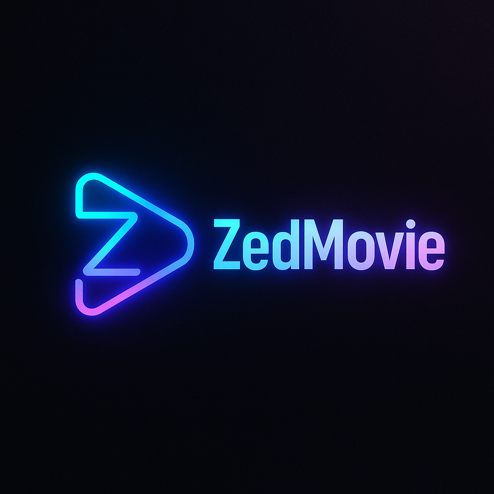

# 🎬 ZedMovie Desktop

<div align="center">




**A Premium Cross-Platform Movie & Series Streaming Application**

[](https://flutter.dev)
[](LICENSE)
[](https://github.com)

[Installation](#installation) • [Build](#build-from-source) • [Contributing](#contributing)

</div>

---

Telegram Channel: [@CluvexStudio](https://t.me/CluvexStudio)

 ---
## ✨ Features

### 🎥 **Premium Video Player**
- Full-screen support with hardware acceleration
- Playback speed control (0.5x - 2.0x)
- Advanced volume controls
- Seek controls with keyboard shortcuts
- Auto-hide controls for immersive viewing
- Professional UI with smooth animations

### 🎨 **Modern UI/UX**
- Elegant dark/light theme support
- Material Design 3 principles
- Gradient overlays and shadows
- Smooth animations and transitions
- Interactive hover effects
- Responsive grid layouts
- Loading states with shimmer effects
- Professional card designs with rounded corners

### 📚 **Content Library**
- Browse thousands of movies and TV series
- Filter by genre, year, IMDB rating
- Advanced search functionality
- Country-based content filtering
- Favorites management with persistence
- Watch history tracking
- Multiple quality options (480p, 720p, 1080p)
- High-quality posters and cover images

### 🚀 **Performance**
- Hardware-accelerated video playback via MPV
- Optimized memory management
- Fast REST API integration with fallback servers
- Image caching for faster loading
- Smooth 60 FPS animations
- Minimal resource consumption

### 🖥️ **Cross-Platform**
- Windows 7+ support
- Linux (any modern distribution)
- macOS 10.9+ support

---

## 📸 Screenshots

### Home Screen
Browse latest movies and series with beautiful card layouts

### Video Player
Full-featured video player with modern controls

### Favorites
Manage your favorite content with ease

---

## 🔧 Installation

### Quick Install

Download the latest release for your platform:

**Windows**
```bash
# Download ZedMovie-Windows-x64.zip from releases
# Extract and run zedmoviedesktop.exe
```

**Linux**
```bash
# Download ZedMovie-Linux-x64.tar.gz from releases
tar -xzf ZedMovie-Linux-x64.tar.gz
cd zedmoviedesktop
./zedmoviedesktop
```

**macOS**
```bash
# Download ZedMovie-macOS.zip from releases
# Extract and run zedmoviedesktop.app
```

### Linux Dependencies

For Linux users, install required dependencies:

**Ubuntu/Debian**
```bash
sudo apt install libmpv-dev mpv libgtk-3-dev
```

**Arch Linux**
```bash
sudo pacman -S mpv gtk3
```

**Fedora**
```bash
sudo dnf install mpv-devel gtk3-devel
```

---

## 🛠️ Build from Source

### Prerequisites

- Flutter SDK 3.35.0 or higher
- Dart SDK 3.8.0 or higher
- Git

### Clone Repository

```bash
git clone https://github.com/CluvexStudio/ZedMovieDesktop.git
cd ZedMovieDesktop
```

### Install Dependencies

```bash
flutter pub get
```

### Build

**Windows**
```bash
flutter build windows --release
```

**Linux**
```bash
flutter build linux --release
```

**macOS**
```bash
flutter build macos --release
```

---

## 🎮 Usage

### Keyboard Shortcuts

| Key | Action |
|-----|--------|
| `Space` | Play/Pause |
| `F` | Toggle Fullscreen |
| `←` | Seek backward 10s |
| `→` | Seek forward 10s |
| `↑` | Volume up |
| `↓` | Volume down |
| `M` | Mute/Unmute |
| `Esc` | Exit fullscreen |

### Mouse Controls

- **Single Click**: Show/hide controls
- **Double Click (Left)**: Seek backward 10s
- **Double Click (Right)**: Seek forward 10s

---

## 🏗️ Project Structure

```
lib/
├── constants/
│   └── app_theme.dart          # App theme configuration
├── models/
│   ├── movie.dart              # Movie model
│   ├── series.dart             # Series model
│   ├── genre.dart              # Genre model
│   └── ...
├── providers/
│   ├── movie_provider.dart     # Movie state management
│   ├── series_provider.dart    # Series state management
│   └── search_provider.dart    # Search state management
├── screens/
│   ├── home_screen.dart        # Home page
│   ├── video_player_screen.dart # Video player
│   └── ...
├── services/
│   └── api_service.dart        # API integration
├── widgets/
│   ├── movie_card.dart         # Movie card widget
│   ├── animated_card.dart      # Animated card widget
│   └── ...
└── main.dart                   # App entry point
```

---

## 🤝 Contributing

Contributions are welcome! Please feel free to submit a Pull Request.

1. Fork the repository
2. Create your feature branch (`git checkout -b feature/AmazingFeature`)
3. Commit your changes (`git commit -m 'Add some AmazingFeature'`)
4. Push to the branch (`git push origin feature/AmazingFeature`)
5. Open a Pull Request

---

## 📝 License

This project is licensed under the GNU General Public License v3.0 - see the [LICENSE](LICENSE) file for details.

### GPL-3.0 License Summary

- ✅ **Freedom to Use**: You can use this software for any purpose
- ✅ **Freedom to Study**: You can study how the program works and modify it
- ✅ **Freedom to Share**: You can redistribute copies
- ✅ **Freedom to Improve**: You can distribute modified versions
- ⚠️ **Copyleft**: Any derivative work must also be licensed under GPL-3.0
- ⚠️ **Source Code**: You must provide source code when distributing

---

## 🙏 Acknowledgments

- [Flutter](https://flutter.dev) - UI framework
- [media_kit](https://pub.dev/packages/media_kit) - Video playback
- [Provider](https://pub.dev/packages/provider) - State management
- API powered by hostinnegar.com

---

## 📧 Contact

For questions or support, please open an issue on GitHub.

---

<div align="center">

**Made with ❤️ using Flutter**

⭐ Star this repository if you find it helpful!

</div>
